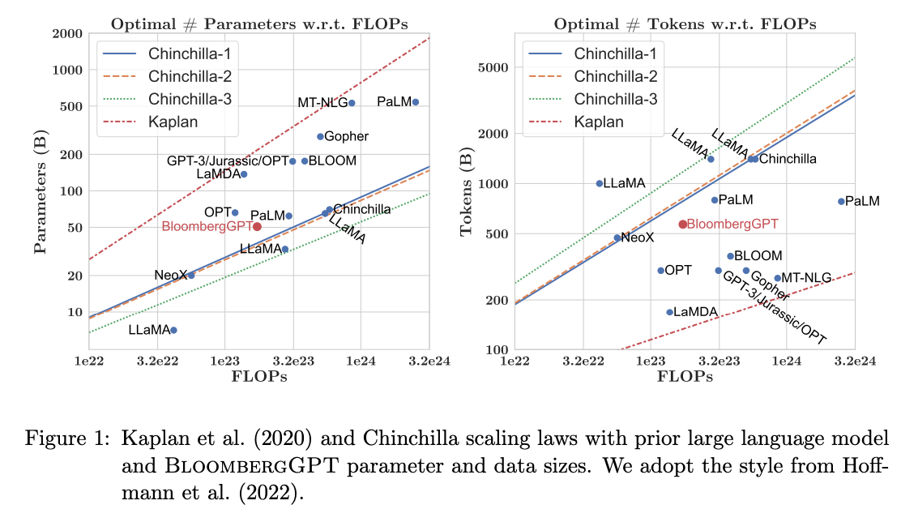
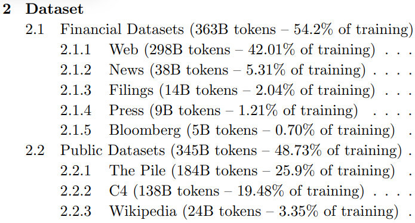

## Own Notes

### Affects at Inference Stage

- **Greedy:** Selects the top token with the highest probability.
- **Random:** Uses a weighted sampling approach to select tokens based on their probabilities, allowing for variations in selection (e.g., a 20% chance of selecting a token).

### Strategies for Token Sampling

1. **Max New Tokens:** Limits the number of tokens generated.
2. **Sample Top K:** Selects the top k results after applying the random weighted strategy, allowing for more diverse outputs.
3. **Sample Top P:** Tokens selected using the random weighted strategy must have probabilities less than or equal to p.
4. **Temperature:** Affects the peak and tail of the probability distribution, influencing the randomness of token selection.

### Transformers

- **Encoder-Only LLM (Autoencoding Models):**
  - Provides bidirectional context of input and is used for tasks like sentiment analysis, named entity recognition (NER), and word classification.
  - Examples: BERT, RoBERTa.

- **Decoder-Only LLM (Autoregressive Models):**
  - Offers unidirectional context of input and is used for tasks like text generation.
  - Examples: GPT, BLOOM.

- **Encoder-Decoder LLM (Sequence-to-Sequence Models):**
  - Takes input from the encoder and generates output in the decoder, often used for tasks like translation, text summarization, and question answering.
  - Examples: T5, BART.

### Quantization

Quantization involves mapping numbers to lower-precision representations to reduce memory requirements.

### In-Context Learning

In-context learning involves providing instruction prompts to the LLM. It enables one-shot or few-shot inference, but the context window has limitations in terms of the number of examples it can accommodate.

### Instruction-Full Fine Tuning

- Many prompt-completion pairs dataset are split into training, testing, and validation sets.
- One task often requires 500 to 1000 examples.
- Fine-tuning can lead to catastrophic forgetting, necessitating multi-task fine-tuning.
- Examples include FLAN models that use specific sets of instructions to perform tasks.

### LLM Evaluation

- **ROUGE (Recall-Oriented Understudy for Gisting Evaluation):**
  - ROUGE-1: Measures unigram matches with reference texts, including recall, precision, and clipping.
  - ROUGE-2: Focuses on bigram matches.
  - ROUGE-L: Compares the longest common subsequence (LCS) with unigrams.

- **BLEU (Bilingual Evaluation Understudy):** Measures the overlap of generated text with reference texts.

### Benchmarks

- **GLUE (General Language Understanding Evaluation):** Evaluates language understanding models on various tasks.

- **HELM (Human Evaluation of Language Models):** Includes metrics like accuracy, calibration, robustness, fairness, bias, toxicity, and efficiency to assess language models.

### Parameter Efficiency Fine-Tuning (PEFT)

1. **Selective:** Selects a subset of initial LLM parameters to fine-tune.
2. **Reparameterization:** Reparameterizes model weights using a low-rank representation, such as LORA and Q-LORA.
3. **Additive:** Adds trainable layers or parameters to the model, including adapters and soft prompts like Prompt Tuning (effective for larger models).

## Week 1

### **Transformer Architecture**

1. **Attention is All You Need**
    - [Read the paper](https://arxiv.org/pdf/1706.03762)
    - 
    - This paper introduced the Transformer architecture, with the core “self-attention” mechanism. This article was the foundation for LLMs.
    - "Attention is All You Need" is a research paper published in 2017 by Google researchers, which introduced the Transformer model, a novel architecture that revolutionized the field of natural language processing (NLP) and became the basis for the LLMs we now know - such as GPT, PaLM, and others. The paper proposes a neural network architecture that replaces traditional recurrent neural networks (RNNs) and convolutional neural networks (CNNs) with an entirely attention-based mechanism. 
    - The Transformer model uses self-attention to compute representations of input sequences, which allows it to capture long-term dependencies and parallelize computation effectively. The authors demonstrate that their model achieves state-of-the-art performance on several machine translation tasks and outperforms previous models that rely on RNNs or CNNs.
    - The Transformer architecture consists of an encoder and a decoder, each of which is composed of several layers. Each layer consists of two sub-layers: a multi-head self-attention mechanism and a feed-forward neural network. The multi-head self-attention mechanism allows the model to attend to different parts of the input sequence, while the feed-forward network applies a point-wise fully connected layer to each position separately and identically. 
    - The Transformer model also uses residual connections and layer normalization to facilitate training and prevent overfitting. In addition, the authors introduce a positional encoding scheme that encodes the position of each token in the input sequence, enabling the model to capture the order of the sequence without the need for recurrent or convolutional operations.

2. **BLOOM: BigScience 176B Model**
    - [Read the paper](https://arxiv.org/abs/2211.05100)
    - BLOOM is an open-source LLM with 176B parameters (similar to GPT-4) trained in an open and transparent way. In this paper, the authors present a detailed discussion of the dataset and process used to train the model. You can also see a high-level overview of the model here.

3. **Vector Space Models**
    - [Course on Coursera](https://www.coursera.org/learn/classification-vector-spaces-in-nlp/home/week/3)
    - Series of lessons from DeepLearning.AI's Natural Language Processing specialization discussing the basics of vector space models and their use in language modeling.

### **Pre-training and scaling laws**

1. **Scaling Laws for Neural Language Models**
    - [Read the paper](https://arxiv.org/abs/2001.08361)
    - Empirical study by researchers at OpenAI exploring the scaling laws for large language models.

**Model architectures and pre-training objectives**

1. **What Language Model Architecture and Pretraining Objective Work Best for Zero-Shot Generalization?**
    - [Read the paper](https://arxiv.org/pdf/2204.05832.pdf)
    - The paper examines modeling choices in large pre-trained language models and identifies the optimal approach for zero-shot generalization.

2. **HuggingFace Tasks and Model Hub**
    - [HuggingFace Tasks](https://huggingface.co/tasks)
    - [HuggingFace Model Hub](https://huggingface.co/models)
    - Collection of resources to tackle varying machine learning tasks using the HuggingFace library.

3. **LLaMA: Open and Efficient Foundation Language Models**
    - [Read the paper](https://arxiv.org/pdf/2302.13971.pdf)
    - Article from Meta AI proposing Efficient LLMs (their model with 13B parameters outperforms GPT3 with 175B parameters on most benchmarks)

### **Scaling laws and compute-optimal models**

1. **Language Models are Few-Shot Learners**
    - [Read the paper](https://arxiv.org/pdf/2005.14165.pdf)
    - This paper investigates the potential of few-shot learning in Large Language Models.

2. **Training Compute-Optimal Large Language Models**
    - [Read the paper](https://arxiv.org/pdf/2203.15556.pdf)
    - Study from DeepMind to evaluate the optimal model size and number of tokens for training LLMs. Also known as “Chinchilla Paper”.

3. **BloombergGPT: A Large Language Model for Finance**
    - [Read the paper](https://arxiv.org/pdf/2303.17564.pdf)
    - LLM trained specifically for the finance domain, a good example that tried to follow chinchilla laws.
    - 
    - 
    - BloombergGPT, developed by Bloomberg, is a large Decoder-only language model. It underwent pre-training using an extensive financial dataset comprising news articles, reports, and market data, to increase its understanding of finance and enabling it to generate finance-related natural language text. The datasets are shown in the image above.
    - During the training of BloombergGPT, the authors used the Chinchilla Scaling Laws to guide the number of parameters in the model and the volume of training data, measured in tokens. The recommendations of Chinchilla are represented by the lines Chinchilla-1, Chinchilla-2, and Chinchilla-3 in the image, and we can see that BloombergGPT is close to it. 
    - While the recommended configuration for the team’s available training compute budget was 50 billion parameters and 1.4 trillion tokens, acquiring 1.4 trillion tokens of training data in the finance domain proved challenging. Consequently, they constructed a dataset containing just 700 billion tokens, less than the compute-optimal value. Furthermore, due to early stopping, the training process terminated after processing 569 billion tokens.
    - The BloombergGPT project is a good illustration of pre-training a model for increased domain-specificity, and the challenges that may force trade-offs against compute-optimal model and training configurations.

## Week 2

### **Multi-task, instruction fine-tuning**

1. **Scaling Instruction-Finetuned Language Models**
   - [Read the paper](https://arxiv.org/pdf/2210.11416.pdf)
   - Scaling fine-tuning with a focus on task, model size, and chain-of-thought data.

2. **Introducing FLAN: More generalizable Language Models with Instruction Fine-Tuning**
   - [Read the blog post](https://ai.googleblog.com/2021/10/introducing-flan-more-generalizable.html)
   - [Read the paper](https://arxiv.org/abs/2210.11416)
    - This blog (and article) explores instruction fine-tuning, which aims to make language models better at performing NLP tasks with zero-shot inference.
    - This paper introduces FLAN (Fine-tuned LAnguage Net), an instruction fine-tuning method, and presents the results of its application. The study demonstrates that by fine-tuning the 540B PaLM model on 1836 tasks while incorporating Chain-of-Thought Reasoning data, FLAN achieves improvements in generalization, human usability, and zero-shot reasoning over the base model. The paper also provides detailed information on how each of these aspects was evaluated.
    - 
    - Here is the image from the lecture slides that illustrates the fine-tuning tasks and datasets employed in training FLAN. The task selection expands on previous works by incorporating dialogue and program synthesis tasks from Muffin and integrating them with new Chain of Thought Reasoning tasks. It also includes subsets of other task collections, such as T0 and Natural Instructions v2. Some tasks were held out during training, and they were later used to evaluate the model's performance on unseen tasks.

### **Model Evaluation Metrics**

1. **HELM - Holistic Evaluation of Language Models**
    - [Visit HELM](https://crfm.stanford.edu/helm/latest/)
    - HELM is a living benchmark to evaluate Language Models more transparently. 

2. **General Language Understanding Evaluation (GLUE) benchmark**
    - [Read the paper](https://openreview.net/pdf?id=rJ4km2R5t7)
    - This paper introduces GLUE, a benchmark for evaluating models on diverse natural language understanding (NLU) tasks and emphasizing the importance of improved general NLU systems.

3. **SuperGLUE**
    - [Visit SuperGLUE](https://super.gluebenchmark.com/)
    - This paper introduces SuperGLUE, a benchmark designed to evaluate the performance of various NLP models on a range of challenging language understanding tasks.

4. **ROUGE: A Package for Automatic Evaluation of Summaries**
    - [Read the paper](https://aclanthology.org/W04-1013.pdf)
    - This paper introduces and evaluates four different measures (ROUGE-N, ROUGE-L, ROUGE-W, and ROUGE-S) in the ROUGE summarization evaluation package, which assess the quality of summaries by comparing them to ideal human-generated summaries.

5. **Measuring Massive Multitask Language Understanding (MMLU)**
    - [Read the paper](https://arxiv.org/pdf/2009.03300.pdf)
    - This paper presents a new test to measure multitask accuracy in text models, highlighting the need for substantial improvements in achieving expert-level accuracy and addressing lopsided performance and low accuracy on socially important subjects.

6. **BigBench-Hard - Beyond the Imitation Game: Quantifying and Extrapolating the Capabilities of Language Models**
    - [Read the paper](https://arxiv.org/pdf/2206.04615.pdf)
    - The paper introduces BIG-bench, a benchmark for evaluating language models on challenging tasks, providing insights on scale, calibration, and social bias.

### **Parameter-efficient fine-tuning (PEFT)**

1. **Scaling Down to Scale Up: A Guide to Parameter-Efficient Fine-Tuning**
    - [Read the paper](https://arxiv.org/pdf/2303.15647.pdf)
    - This paper provides a systematic overview of Parameter-Efficient Fine-tuning (PEFT) Methods in all three categories discussed in the lecture videos.

2. **On the Effectiveness of Parameter-Efficient Fine-Tuning**
    - [Read the paper](https://arxiv.org/pdf/2211.15583.pdf)
    - The paper analyzes sparse fine-tuning methods for pre-trained models in NLP.

**LoRA**

1. **LoRA Low-Rank Adaptation of Large Language Models**
    - [Read the paper](https://arxiv.org/pdf/2106.09685.pdf)
    -  This paper proposes a parameter-efficient fine-tuning method that makes use of low-rank decomposition matrices to reduce the number of trainable parameters needed for fine-tuning language models.

2. **QLoRA: Efficient Finetuning of Quantized LLMs**
    - [Read the paper](https://arxiv.org/pdf/2305.14314.pdf)
    - This paper introduces an efficient method for fine-tuning large language models on a single GPU, based on quantization, achieving impressive results on benchmark tests.

### **Prompt tuning with soft prompts**

1. **The Power of Scale for Parameter-Efficient Prompt Tuning**
    - [Read the paper](https://arxiv.org/pdf/2104.08691.pdf)
    - The paper explores "prompt tuning," a method for conditioning language models with learned soft prompts, achieving competitive performance compared to full fine-tuning and enabling model reuse for many tasks.

## Week 3

### **Reinforcement Learning from Human-Feedback (RLHF)**

1. **Training language models to follow instructions with human feedback**
    - [Read the paper](https://arxiv.org/pdf/2203.02155.pdf)
    - Paper by OpenAI introducing a human-in-the-loop process to create a model that is better at following instructions (InstructGPT).

2. **Learning to summarize from human feedback**
    - [Read the paper](https://arxiv.org/pdf/2009.01325.pdf)
    - This paper presents a method for improving language model-generated summaries using a reward-based approach, surpassing human reference summaries.

### **Proximal Policy Optimization (PPO)**

1. **Proximal Policy Optimization Algorithms**
    - [Read the paper](https://arxiv.org/pdf/1707.06347.pdf)
    - The paper from researchers at OpenAI that first proposed the PPO algorithm. The paper discusses the performance of the algorithm on a number of benchmark tasks, including robotic locomotion and game play.

2. **Direct Preference Optimization: Your Language Model is Secretly a Reward Model**
    - [Read the paper](https://arxiv.org/pdf/2305.18290.pdf)
    - This paper presents a simpler and effective method for precise control of large-scale unsupervised language models by aligning them with human preferences.

### **Scaling human feedback**

1. Constitutional AI: Harmlessness from AI Feedback
    - [Read the paper](https://arxiv.org/pdf/2212.08073.pdf)
    - This paper introduces a method for training a harmless AI assistant without human labels, allowing better control of AI behavior with minimal human input.

### **Advanced Prompting Techniques**

1. **Chain-of-thought Prompting Elicits Reasoning in Large Language Models**
    - [Read the paper](https://arxiv.org/pdf/2201.11903.pdf)
    - Paper by researchers at Google exploring how chain-of-thought prompting improves the ability of LLMs to perform complex reasoning.

2. **PAL: Program-aided Language Models**
    - [Read the paper](https://arxiv.org/abs/2211.10435)
    - This paper proposes an approach that uses the LLM to read natural language problems and generate programs as the intermediate reasoning steps.

3. **ReAct: Synergizing Reasoning and Acting in Language Models**
    - [Read the paper](https://arxiv.org/abs/2210.03629)
    - This paper presents an advanced prompting technique that allows an LLM to make decisions about how to interact with external applications.

### **LLM powered application architectures**

1. **LangChain Library (GitHub)**
    - [Visit the GitHub repository](https://github.com/hwchase17/langchain)
    - This library is aimed at assisting in the development of those types of applications, such as Question Answering, Chatbots, and other Agents. You can read the documentation here.

2. **Who Owns the Generative AI Platform?**
    - [Read the article](https://a16z.com/2023/01/19/who-owns-the-generative-ai-platform/)

### **KL Divergence**
- 
- KL-Divergence, or Kullback-Leibler Divergence, is a concept often encountered in the field of reinforcement learning, particularly when using the Proximal Policy Optimization (PPO) algorithm. It is a mathematical measure of the difference between two probability distributions, which helps us understand how one distribution differs from another. In the context of PPO, KL-Divergence plays a crucial role in guiding the optimization process to ensure that the updated policy does not deviate too much from the original policy.
- In PPO, the goal is to find an improved policy for an agent by iteratively updating its parameters based on the rewards received from interacting with the environment. However, updating the policy too aggressively can lead to unstable learning or drastic policy changes. To address this, PPO introduces a constraint that limits the extent of policy updates. This constraint is enforced by using KL-Divergence.
- To understand how KL-Divergence works, imagine we have two probability distributions: the distribution of the original LLM and a new proposed distribution of an RL-updated LLM. KL-Divergence measures the average amount of information gained when we use the original policy to encode samples from the new proposed policy. By minimizing the KL-Divergence between the two distributions, PPO ensures that the updated policy stays close to the original policy, preventing drastic changes that may negatively impact the learning process.
- A library that you can use to train transformer language models with reinforcement learning, using techniques such as PPO, is TRL (Transformer Reinforcement Learning). In this link (https://huggingface.co/blog/trl-peft), you can read more about this library and its integration with PEFT (Parameter-Efficient Fine-Tuning) methods, such as LoRA (Low-Rank Adaptation).

### **ReAct: Reasoning and action**
- [Read the paper](https://arxiv.org/abs/2210.03629)
- This paper introduces ReAct, a novel approach that integrates verbal reasoning and interactive decision making in large language models (LLMs). While LLMs have excelled in language understanding and decision making, the combination of reasoning and acting has been neglected. ReAct enables LLMs to generate reasoning traces and task-specific actions, leveraging the synergy between them. The approach demonstrates superior performance over baselines in various tasks, overcoming issues like hallucination and error propagation. ReAct outperforms imitation and reinforcement learning methods in interactive decision making, even with minimal context examples. It not only enhances performance but also improves interpretability, trustworthiness, and diagnosability by allowing humans to distinguish between internal knowledge and external information.
- In summary, ReAct bridges the gap between reasoning and acting in LLMs, yielding remarkable results across language reasoning and decision making tasks. By interleaving reasoning traces and actions, ReAct overcomes limitations and outperforms baselines, not only enhancing model performance but also providing interpretability and trustworthiness, empowering users to understand the model's decision-making process.
- 
- Image: The figure provides a comprehensive visual comparison of different prompting methods in two distinct domains. The first part of the figure (1a) presents a comparison of four prompting methods: Standard, Chain-of-thought (CoT, Reason Only), Act-only, and ReAct (Reason+Act) for solving a HotpotQA question. Each method's approach is demonstrated through task-solving trajectories generated by the model (Act, Thought) and the environment (Obs). The second part of the figure (1b) focuses on a comparison between Act-only and ReAct prompting methods to solve an AlfWorld game. In both domains, in-context examples are omitted from the prompt, highlighting the generated trajectories as a result of the model's actions and thoughts and the observations made in the environment. This visual representation enables a clear understanding of the differences and advantages offered by the ReAct paradigm compared to other prompting methods in diverse task-solving scenarios.
